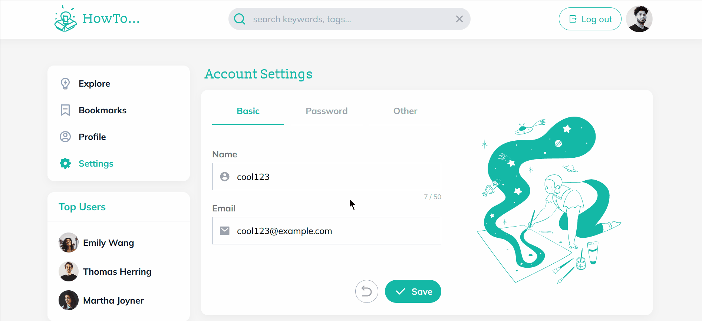
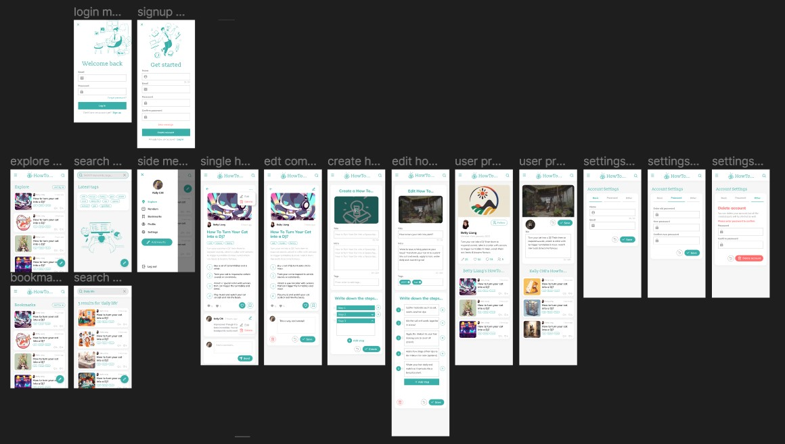

<div align="center">
  

# HowTo

#### Create, Share and Connect with your unique how-to ideas

</div>

### 📜 Table of Contents

<details>
<summary>Click me</summary>

- [HowTo](#howto) - [Create, Share and Connect with your unique how-to ideas](#create-share-and-connect-with-your-unique-how-to-ideas)
  - [📜 Table of Contents](#-table-of-contents)
  - [💡 Overview](#-overview)
    - [👀 Live demo: https://howto-creative.web.app/](#-live-demo-httpshowto-creativewebapp)
    - [🧩 Built with](#-built-with)
  - [✨ Features](#-features)
    - [Drag and drop to re-order the steps](#drag-and-drop-to-re-order-the-steps)
    - [Bookmark your favorite how-to creations](#bookmark-your-favorite-how-to-creations)
    - [Search for all kinds of how-to ideas](#search-for-all-kinds-of-how-to-ideas)
    - [Personalize your profile with custom bio and images](#personalize-your-profile-with-custom-bio-and-images)
    - [Manage your username, email and password easily](#manage-your-username-email-and-password-easily)
    - [🤔 Future Features](#-future-features)
  - [🚀 Run locally](#-run-locally)
  - [💻 Tech Stack](#-tech-stack)
    - [Core Technologies](#core-technologies)
    - [Firebase v9.21.0](#firebase-v9210)
    - [Packages](#packages)
    - [Development tools](#development-tools)
    - [📦 File Structure](#-file-structure)
    - [🤯 Development Process](#-development-process)
      - [Design file](#design-file)
      - [User flow](#user-flow)
      - [Functional map](#functional-map)
      - [Sitemap draft](#sitemap-draft)
  - [🔒 License](#-license)

</details>

## 💡 Overview

HowTo is a place to discover and craft unique step-by-step tutorials, from DIY projects to everyday challenges. While the guides may not claim to be the world's most practical, they are guaranteed to spark smiles and foster creativity!

### 👀 Live demo: https://howto-creative.web.app/

### 🧩 Built with

[](https://skillicons.dev)


## ✨ Features

#### Drag and drop to re-order the steps


#### Bookmark your favorite how-to creations


#### Leave a comment to share your thoughts


#### Search for all kinds of how-to ideas


#### Personalize your profile with custom bio and images


#### Manage your username, email and password easily



#### 🤔 Future Features

- Use existed how-to tutorials as starting template
- Save creation to drafts, edit and publish later
- Get notifications when following users post a new tutorial
- Develop backend code to separate data logic from the UI logic

## 🚀 Run Locally

1. Clone this project to your local environment

```bash
$ git clone "https://github.com/KellyCHI22/HowTo.git"
```

2. Open the project and type the following command in your terminal

```bash
$ npm install
```

3. Continue with this command after finishing installing all the packages

```bash
$ npm run dev
```

4. Open your browser and navigate to the following path: `http://localhost:5173/`

5. Account for testing：

```
email：cool123@example.com
password：cool123
```

6. Type the following command to stop the dev server

```bash
ctrl + c
```

## 💻 Tech Stack

### Core Technologies

- TypeScript 5.0.2
- React 18 (Hooks) 18.2.0
- React Router 6.11.1
- React Redux 8.0.5
- Redux toolkit / Redux toolkit query 1.9.5
- Tailwind CSS 3.3.2

### Firebase v9.21.0

- Authentication
- Firestore
- Storage
- Hosting

### Packages

- react-beautiful-dnd 13.1.1
- react-firebase-hooks 5.1.1
- react-paginate 8.2.0
- react-responsive 9.0.2
- react-icons 4.8.0
- react-spinners 0.13.8
- javascript-time-ago 2.5.9
- react-time-ago 7.2.1
- clsx 1.2.1
- browser-image-compression 2.0.2

### Development Tools

- Vite 4.3.2
- Eslint 8.38.0
- Prettier 2.8.8
- Vitest 0.32.2
- @testing-library/jest-dom 5.16.5
- @testing-library/react 14.0.0
- @testing-library/user-event 14.4.3

### 📦 File Structure

```
-- public
-- src
  |__ App.tsx
  |__ assets
  |__ components
    |__ elements
    |__ layouts
  |__ hooks
  |__ pages
  |__ store
    |__ apis
  |__ utils
```

### 🤯 Development Process

#### Design file




#### User flow


#### Functional map


## 🔒 License

Copyright Notice and Statement: currently not offering any license. Permission only to view and download.
